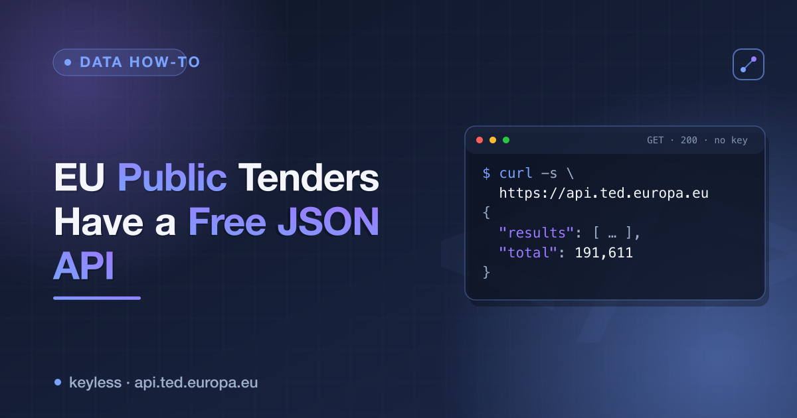

# EU TED (Tenders Electronic Daily) JSON API — a cheatsheet



**TED** is the EU's official journal of public procurement — 480,000+ notices from every
government buyer across the bloc. It exposes all of it as clean JSON through a free,
**keyless** v3 search API. No sign-up, no API key, no paid tier — search and retrieval are
fully anonymous (only *submitting* a notice requires auth).

Endpoint: `POST https://api.ted.europa.eu/v3/notices/search`

## Request body

| Field | Type | Purpose |
|---|---|---|
| `query` | string | TED expert-search syntax (see below) — required |
| `fields` | string[] | eForms field names to return (allowlist; `notice-title` always included) |
| `limit` | int | Results per page, ≤ 100 |
| `scope` | string | `"ACTIVE"` (currently open notices) or `"ALL"` (full historical archive) |
| `paginationMode` | string | `"ITERATION"` for paging through large result sets |
| `page` | int | Page number when iterating |

## Expert-search query syntax

| Piece | Example |
|---|---|
| Full-text | `FT~"cloud computing"` |
| Field filter | `buyer-country=DEU`, `classification-cpv=72000000` |
| Date range | `PD>=20260101` (publication date, `YYYYMMDD`) |
| Combine | `AND`, `OR` |
| Sort | `SORT BY publication-date DESC` |

## Example

```bash
curl -X POST 'https://api.ted.europa.eu/v3/notices/search' \
  -H 'Content-Type: application/json' \
  -d '{
    "query": "FT~\"artificial intelligence\" AND buyer-country=DEU AND PD>=20260101 SORT BY publication-date DESC",
    "fields": ["publication-number", "notice-title", "buyer-name", "buyer-country", "total-value", "deadline"],
    "limit": 50,
    "scope": "ACTIVE",
    "paginationMode": "ITERATION"
  }'
```

## Response fields (eForms names)

| Field | Notes |
|---|---|
| `publication-number` | e.g. `477851-2026`; build the notice URL as `https://ted.europa.eu/en/notice/-/detail/<publication-number>` |
| `notice-title` | Multilingual object (`{"eng": [...], "fra": [...]}`) — prefer `eng`, fall back to any language present |
| `notice-type` | e.g. `cn-standard` |
| `contract-nature` | `works` / `services` / `supplies` |
| `buyer-name`, `buyer-country` | Buyer identity; country is ISO-3 |
| `classification-cpv` | Common Procurement Vocabulary code(s) |
| `total-value`, `total-value-cur` | Contract value + currency, when the notice provides them |
| `publication-date`, `deadline` | `YYYY-MM-DD` (raw values carry a timezone suffix — trim to 10 chars) |
| `links` | Raw links object as returned by TED |

## Notes & gotchas

- Field names are **eForms** names (kebab-case, e.g. `classification-cpv`), not the legacy
  two-letter TED codes — a pre-2023 blog post's query syntax will 404 or return nothing.
- Multilingual fields (title, buyer name) arrive keyed by language, not as a plain string.
- `scope: "ACTIVE"` for live/open notices, `"ALL"` for the full archive back to the mid-2010s.
- Be reasonable with request volume — it's a public-good API, not a firehose to hammer.

## Related

- Full walkthrough article: **[dev.to/ronin13](https://dev.to/ronin13)**
- Prefer structured rows over query-building? The [EU Tenders Scraper](https://apify.com/ponderable_hydrometer/ted-tenders-scraper) on Apify wraps this endpoint — keyword or expert query in, flat rows (buyer, country, CPV, value, deadline, link) out.
